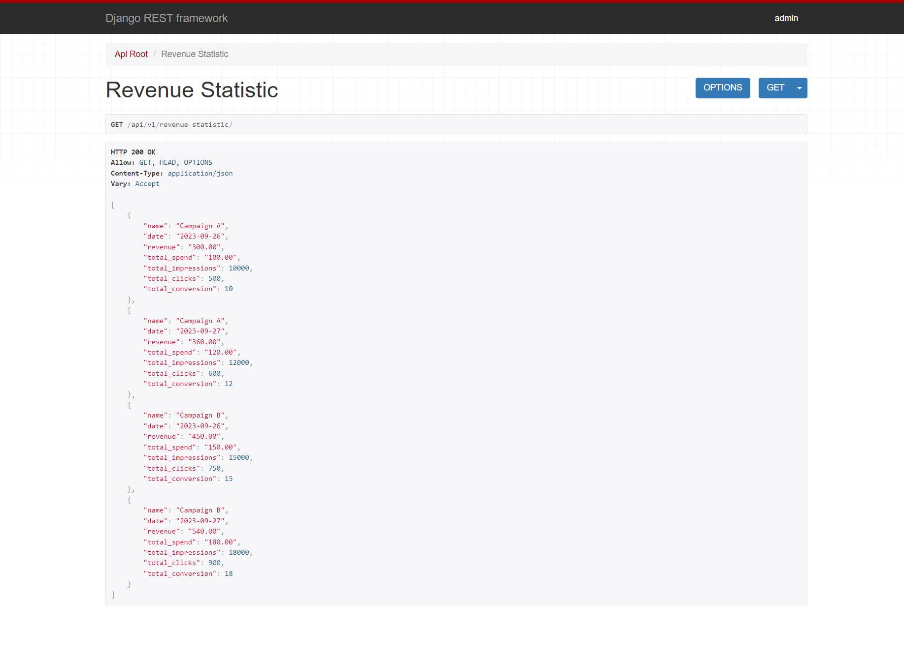
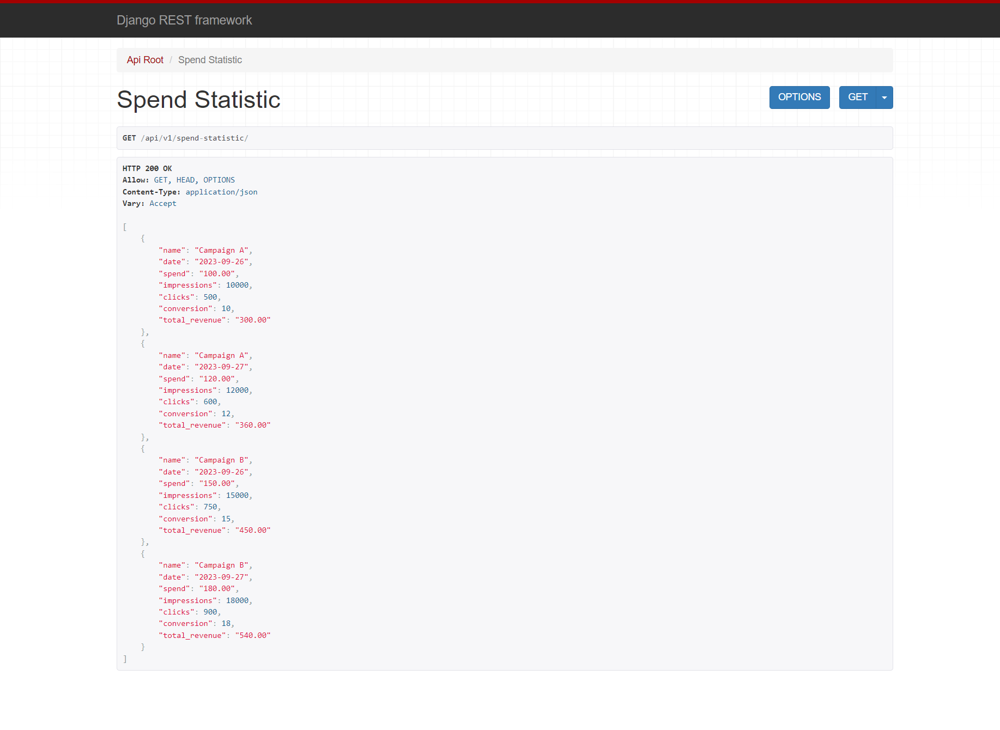

<div align="center">

# Statistic API
</div>
<br>
<hr>

## Table of Contents

- [Application functional](#functional)
- [Technologies](#technologies)
- [Prerequisites](#prerequisites)
- [Setup](#setup)
- [Accessing the Application](#accessing-the-application)
- [Shutdown](#shutdown)
- [Demo](#demo)


<hr>

## Functional


1. CRUD for RevenueStatistic model;
2. CRUD for SpendStatistic model;
3. Get Revenue statistic with related 
spend, impressions, clicks, conversion values from SpendStatistic model;
4. Get Spend statistic with related 
revenue value from RevenueStatistic model;

<hr>

## Technologies

- [Django Rest Framework](https://www.django-rest-framework.org)
<br>Django Rest Framework is a powerful and flexible toolkit for building Web APIs.


- [Postgres](https://www.postgresql.org/docs/)
<br>Postgres is a powerful, open-source object-relational database system. 
<br>In this project, it is used as the main data store, exposed on port 5432.
<hr>


## Prerequisites

1. Make sure you have Docker and Docker Compose installed on your system. 
You can check the installation instructions [here for Docker](https://docs.docker.com/get-docker/) 
and [here for Docker Compose](https://docs.docker.com/compose/install/).

<hr>

## Setup

1. Clone the project:
```
git clone https://github.com/diana-shyrokikh/spend-revenue-statistic.git
```
2. Navigate to the project directory:
```
cd spend-revenue-statistic
```
3. Сreate your `.env` file taking as an example `.env.example` file.


4. Build and run the Docker containers:
```
docker-compose build
docker-compose up
```

<hr>

## Accessing the Application

### Documentation is accessible at:
1. `http://localhost:8000/api/v1/doc/swagger/`
2. `http://localhost:8000/api/v1/doc/redoc/`

### API
1. Airport API Service is accessible at `http://localhost:8000/api/v1/`
2. The Revenue Statistic Page is available at `http://localhost:8000/api/v1/revenue-statistic/`
3. The Spend Statistic Page is available at `http://localhost:8000/api/v1/spend-statistic/`
4. Django Admin Page is accessible at `http://localhost:8000/admin/`


<hr>

## Shutdown

1. To stop running the server use CTRL-C

<hr>

## Demo




<hr>

Remember to replace `localhost` with the relevant 
IP address if you're not accessing these 
from the same machine where the services are running.

<hr>
